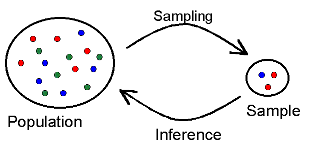

<!-- To allow for two column layout -->
<style>
.forceBreak { -webkit-column-break-after: always; break-after: column; }
</style>

## Why sampling?

* In most cases a complete enumeration is not possible, but if done properly, proporties of a population can be inferred from a randomly selected sample



## General approach

* Overall planning of the survey
* Define the population of interest
* Constructing the sampling frame
* Choice of sampling design
* Selection of sample
* Data collection
* Data editing and imputation
* Estimation
* Dissemination


## Sampling error

> - The fact that not all units go into the inference introduces an uncertainty about the estimates which we call **sampling error**
> - The sampling error is a consequence of the fact that we would get (slightly) different results if we could **repeatedly draw** new samples
> - Given a sampling design the sampling error will generally be lower if the units in the population are alike (**low variance**) or the sample size is bigger
> - **Note:** For the same sample size the sampling error will be smaller if a suitable design is chosen


## Simple demonstration of sampling error

```{r}
# synthetic population
set.seed(236542)
N <- 1000
yi <- rnorm(N, mean=5000, s=1000)

# attributes at population level
mean (yi)
```
***

```{r}
hist (yi)
```

***
```{r}
# take a sample of size n
n <- 10
s <- sample(1:length(yi), n, replace = FALSE)

# mean of sample
mean(yi[s])
mean(yi)
```
***
```{r}
# repeat sampling K times
K <- 1000
mu_hat <- numeric(K)

for (i in 1:K){
  s <- sample(1:length(yi), n, replace = FALSE)
  mu_hat[i] <- mean(yi[s])
}

mean(mu_hat)  
```
***
```{r}
# sampling distribution
hist(mu_hat)  
```

## Representativity

> - Representativity is **not** dependent upon the sample size
> - For a sample to be representative, **all** units must have the **possibily** to be in the sample (inclusion probability > 0)
    <!-- * Furthermore, the inclusion probabilities $\pi_i$ must be known in order to calculate the actual estimates -->
    <!-- * Also, in some case the **second-order** inclusion probabilities $\pi_{ij}$ must be known to estimate the variance -->
    <!-- * Often both $\pi_i$ and $\pi_{ij}$ follow directly from the design -->
> - The intuitive meaning of a **representative** sample normally is that has a certain size, but also that the marginal proporties of the sample resemble those of the population
>     - Certain procedures exist that makes a **balanced sample** in exactly this meaning
>     - A balanced sample is also said to be **well spread** and actual measures for this have been constructed (see eg. Grafström og Tillé)
   

## SRS: Simple random sampling

> - SRS is one of the fundamental building blocks
> - Assume a population of size $N$ and that a sampling frame (a list of units) is available
> - Randomly select $n$ out of $N$ units without replacement
> - The implied inclusion probability is $\pi = n/N$
> - Note: This is **equivalent** to considering the $C(N,n)$ possible $n$-subsets and randomly select one of these as the sample!


<!-- ## SRS: $s \subset U$ -->

<!-- ```{r echo=FALSE} -->
<!-- library(png) -->
<!-- library(grid) -->
<!-- img <- readPNG("pics/U_and_s.png") -->
<!-- grid.raster(img) -->
<!-- ``` -->

## SSRS, Stratified Simple Random Sampling

* A **stratification** is a subdivision of the population into different groups, called **strata**
* Stratification allows for **different inclusion probabilities**, e.g. more large companies or more units that we know are unlikely to respond
* In stratified simple random sampling with $H$ strata, the strata are usually written as $N_h, h = 1, \dots, H$, the number of units in each stratum is $n_h$, and their inclusion probabilities are $\pi_h = \frac{n_h}{N_h}$

## Stratification variables

* There is no right or wrong stratification, but a good stratification can decrease variance significantly
* Stratification variables are the variables used to divide the population into subgroups
* consider this population
```{r}
load(file = "mydata_example.Rda")
head(mydata_example[, 1:6], n=5)
```

***
A stratification by region and sector would look like this:

```{r, include=F}
plot(mydata_example$sector, mydata_example$region)

```

{height=550px}


## A Note on choice of Stratification 

* A stratification might get too fine grained, i.e. there's not enough sample units to get a sufficient amount of units in each stratum
* There's no official, minimal sample size per stratum, but we recommend at least 10 units
* If your stratification doesn't allow for that, choose a larger sample size or a coarser stratification
* (A coarser stratification means less strata)

## Allocation

* Allocation is the distribution of a sample of size $n$ across the $H$ strata
* Allocating a sample and drawing a sample is not the same thing
* There's no right or wrong allocation, but we would try to allocate units in order to best meet the objectives in the survey design, e.g. allocate according to (known or expected) response propensities, or in order to cover 70 % of the turnover of the companies in each sector
* A well-chosen sample allocation together with a well-chosen stratification can minimise the uncertainty or sampling error significantly

## Some Allocation Methods

* There are several ways of allocating a sample:
   * Proportional Allocation, in which we allocate the sample units proportionally to stratum size, or to the proportion of some measure of interest in each stratum, e.g. number of employees
   * Weighted proportional allocation, in which we use a weighted sum of allocations proportional to various variables of interest
   * Optimal or Neyman allocation, in which we allocate sample units according to the variation of a variable of interest in each stratum, so that we allocate more sample units in strata with more variation
   
## Allocation Formulas

* Proportional Allocation is computed by this formula: 

    $n_h = n \cdot \frac{N_h}{\sum_{h = 1}^H N_h}$, 
    
where $H$ is the number if strata, $n$ is the sample size, and $N_h$ is the size of stratum $h$ (either in population units or in terms of some other measurement)

* Optimal or Neyman Allocation is computed by this formula:

    $n_h = n \cdot \frac{N_h s_h}{\sum_{h = 1}^H N_h s_h}$,
    
where $s_h$ is the standard error in stratum $h$ of a variable of interest 

## Definitions and Corrections

* Our sampling method may allocate more units than $N_h$ or may allocate $n_h < 10$. In that case, some corrections are necessary.
* Strata in which we allocate no units (e.g. because the units in those strata are "small" in the sense that they are below some bagatel threshold, e.g. 10 employees or turnover below 50,000) are called **take none**
* Strata in which we allocate some but not all units are called *take some*
* Strata in which we allocate all units (e.g. because the strata are small or because the units are "large" or "important" in some sense) are called **take all*

***
* Using the **samplingbook** package written by Juliane Manitz and others will give us a lot of functionality automatically

```{r message=FALSE, warning=FALSE}
library(samplingbook)
```

***

* In order to use our stratification, we first have to create a variable counting the strata
```{r}
load(file = "mydata_example.Rda")

Strata <- unique (mydata_example[,c("sector", "region")])
Strata <- Strata[order(Strata$sector, Strata$region),]
rownames(Strata) <- NULL
Strata$stratum <- 1:dim(Strata)[1]
Strata <- Strata[c(3,1,2)]
head(Strata, n = 5)
```

Then we merge it onto our dataframe

```{r}
mydata_example <- merge (mydata_example, Strata, 
                          by=c("sector", "region"))
mydata_example[c(1,72,140,210,281,396,525,630,741,949),]
```

## Allocating a Proportional Sample 

* We now want two summary statistics on stratum level: Size of each stratum (Nh) and standard deviation of last years turnover (sh)

* We calculate the size of each stratum and also the standard deviation of last years turnover (we do not need this for proportional allocation, but we'll need it for Neyman allocation later on)

***

```{r}
Nh <- aggregate (mydata_example$stratum,
                 list(stratum=mydata_example$stratum),
                 length)
names(Nh)[2] <- "Nh"

sh <- aggregate (mydata_example$turnover_2019,
                 list(stratum=mydata_example$stratum),
                 sd, na.rm=TRUE)
names(sh)[2] <- "sh"

Strata <- merge(Strata, Nh, by="stratum")
Strata <- merge(Strata, sh, by="stratum")
```

***

```{r, echo = F} 
Strata
```

***

* We can now use the function **stratasamp** from the samplingbook package in order to allocate a sample. 

    **stratasamp(n, Nh, Sh = NULL, Ch = Null, type = 'prop')**,
    
    where **n** is sample size, **Nh** is stratum size, **Sh** is stratum stabdard error, **Ch** is cost (which we will not look into here) and **type** is the allocation method, which defaults to 'prop' = proportional.

* Note that the sample allocation takes place in the dataframe **Strata**, not in the dataframe that we want to draw the sample from.


```{r}
n <- 1000
alloc1 <- stratasamp (n, Nh=Strata$Nh)
```

***

```{r}
alloc1
```

Adding alloc1 to the sample data frame:

```{r}
Strata$nh_prop <- alloc1[2,]
Strata$f_prop <- Strata$nh_prop/Strata$Nh
```

## Allocation a Neyman Sample

* Notice that type is set to 'opt', as Neyman allocation goes by the name of optimal allocation, too.

```{r}
n <- 1000
alloc2 <- stratasamp (n, Nh=Strata$Nh, Sh=Strata$sh, type="opt")
```

***

```{r}
alloc2
```

However, the allocation procedure doesn't take stratum size into consideration:

```{r}
Strata$nh <- alloc2[2,]
impossible_allocation <- (Strata$nh > Strata$Nh)
impossible_allocation

```

***

* We can add the TRUEs together, and then we get:

```{r}
sum (impossible_allocation)

```

That is, there are 4 strata in which we have allocated more units than there are in the stratum. Luckily, this can be fixed.

***

At first, we make the offending strata into take all strata (utilising that TRUE acts as the value 1):

```{r}
Strata$nh[impossible_allocation] <- Strata$Nh[impossible_allocation]
Strata$nh[!impossible_allocation] <- NA
```

And the remaining sample is allocated using the same function

```{r}
n_rem <- n - sum(Strata$nh, na.rm=TRUE)
s <- Strata [!impossible_allocation, ]
alloc2.2 <- stratasamp (n_rem, Nh=s$Nh, Sh=s$sh)
alloc2.2
```

***

Putting allocation and Strata data frame back together, we get:


```{r}
s$nh <- alloc2.2[2,]
Strata <- rbind (Strata[impossible_allocation,], s)
sum (Strata$nh)
```
We can adjust a bit more to adhere to the "at least 10 units"-rule, and then we get:

```{r}
Strata$nh[Strata$nh < 10] <- 10
Strata <- Strata[order(Strata$stratum),]
Strata$f <- Strata$nh / Strata$Nh
sum(Strata$nh)
```

*** 

We now have two different allocations:

```{r}
Allocs <- Strata[, c(1,4,6,7,8,9)]

```

***

```{r, echo = F}
Allocs

```


## Drawing a Stratified, Simple Random Sample


Now it is easy to select the sample:

```{r}
library (sampling)
mydata_example <- mydata_example[order(mydata_example$stratum),]

s_prop <- sampling::strata (mydata_example,
                       stratanames="stratum",
                       size=Strata$nh_prop,
                       method="srswor")

s_opt <- sampling::strata (mydata_example,
                       stratanames="stratum",
                       size=Strata$nh,
                       method="srswor")

```

***

Finally extract the samples and save them:

```{r}
mysample_prop <- getdata (mydata_example, s_prop)
mysample_opt <- getdata (mydata_example, s_opt)

save (mysample_prop, file="mysample_prop.Rda")
save (mysample_opt, file="mysample_opt.Rda")
```

## A Brief Note on PPS Sampling

* The strata-function has the following options:

    **strata(data, stratnames = NULL, size, 
             method = c("srswor", "srswr", "poisson", "systematic"), 
             pik, description = FALSE)**
             
* Using the poisson option and calculating the inclusion probabilities cleverly can be used to get PPS sampling

***

* Either aggregate the function *inclusionprobabilities(interest_variable, n_h)* over each stratum, which will calculate the PPS inclusion probabilities of each unit in that stratum (interest_variable might be turnover or number of employees), or 

* Alternatively just providing **interest_variable** as **pik** (which will then call inclusionprobabilities)

* And selecting the option **"poisson"** when drawing the sample 

* Gives PPS Sample

* We use PPS sampling in very few statistics at Statistics Denmark. If you want to have a lot of large units according to some measure, you can put them in a take all-stratum with $n_h = N_h$ or with $f \sim 1$
  


